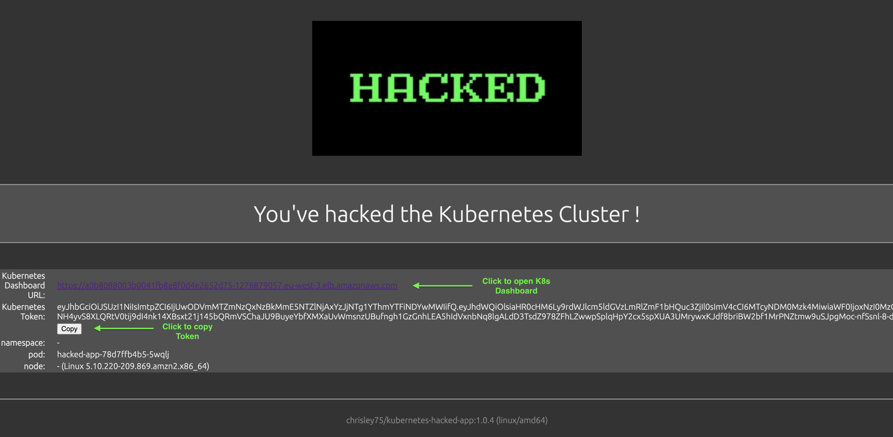

# Hacked Kubernetes demo app

A demo app that can be deployd to a Kubernetes cluster. It displays a message, the K8S Dashboard URL and the K8s Token and also namespace, pod, node and image details.

## Paths

| Method | Path | Description |
| -------| ---- | ----------- |
| GET    | /    | Displays message, pod and node details |

## Configuration

The application can be configured via the following environment variables.

| Env | Required | Default Value | Description |
| --- | -------- | ------------- | ----------- |
| PORT | No | 8080 | The port that the app listens on. |
| MESSAGE | No | "You have hacked the kubernetes cluster!" | The default message displayed by the app. |
| K8SURL | No | "k8s Dashboard URL" | The default K8s URL displayed by the app. |
| K8STOKEN | No | "k8s token to connect" | The default message displayed by the app. |
| RENDER_PATH_PREFIX | No | "" | The path prefix to use when rendering the urls for the static assets in the handlebar templates.   Must be used when app is deployed with an ingress using a backend path for traffic to app. |
| HANDLER_PATH_PREFIX | No | "" | The path prefix to use by handlers when serving the dynamic and static assets.   Note: Must be used when app is deployed with an ingress that has a backend path for traffic to the app, but which does not rewrite the backend paths to '/'. |
| KUBERNETES_NAMESPACE | Yes | "-" | The Kubernetes namespace that the app has been deployed to. |
| KUBERNETES_POD_NAME | Yes | hostname | The name of the Kubernetes pod that the app is deployed into. |
| KUBERNETES_NODE_NAME | Yes | "-" | The name of the Kubernetes node that the app is deployed on. |
| CONTAINER_IMAGE | Yes | "chrisley75/kubernetes-hacked-app:$(cat package.json \| jq -r .version)" | The name and tag of the container image running the app. |

The application relies on the following files for configuration and operational information.

| File | Required | Information | Description |
| ---- | -------- | ----------- | ----------- |
| package.json | Yes | `.version` | The release version is used when the CONTAINER_IMAGE env is not provided. |
| info.json | Yes | `.containerImageArch` | The container image architecture is used for display. This file will be overwritten in future versions as part of the container image build process when multi-arch images are supported. |